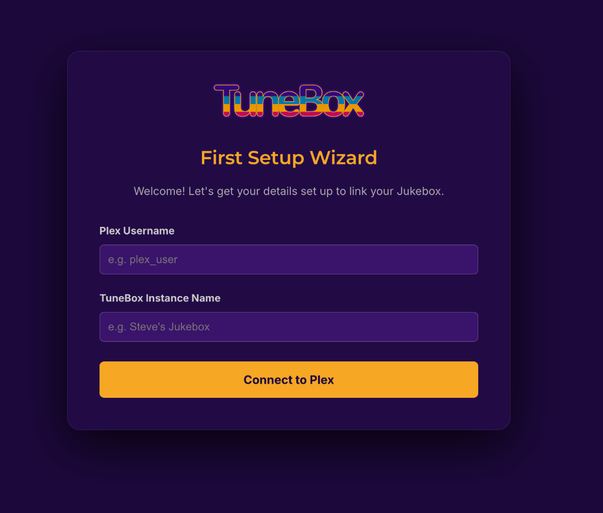
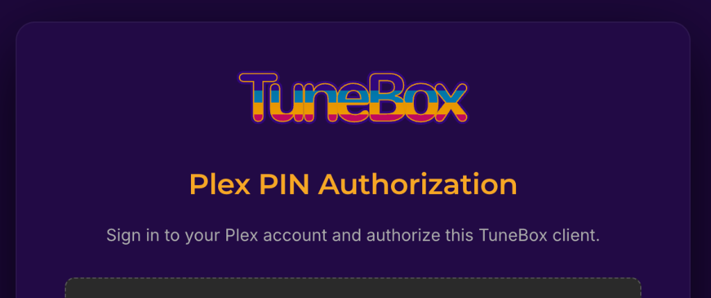
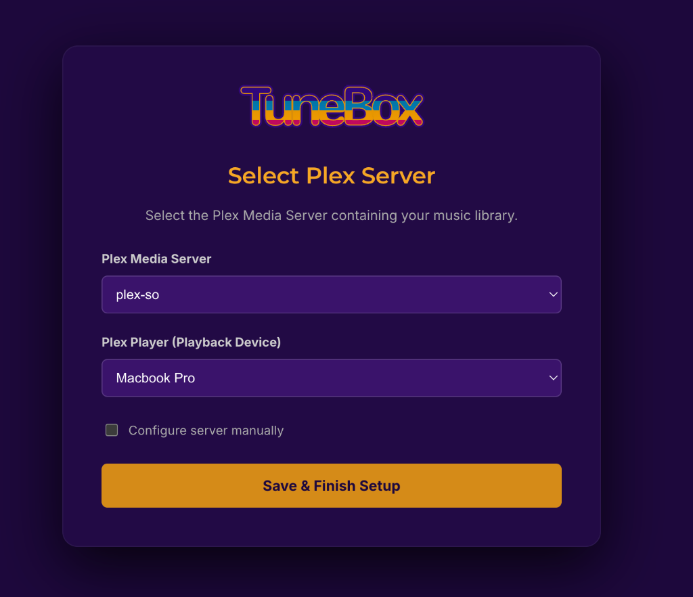
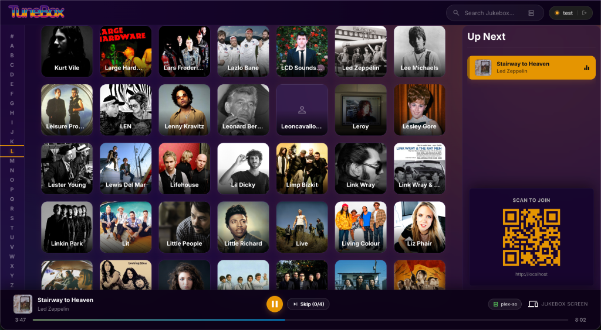
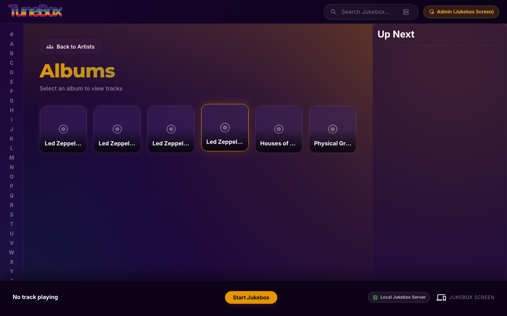
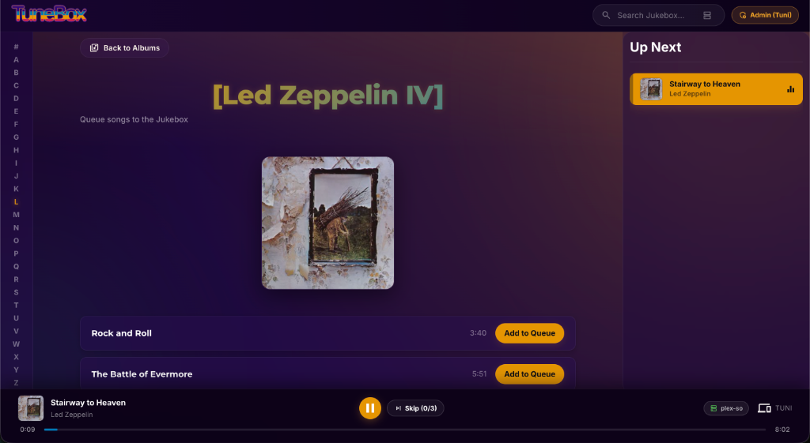
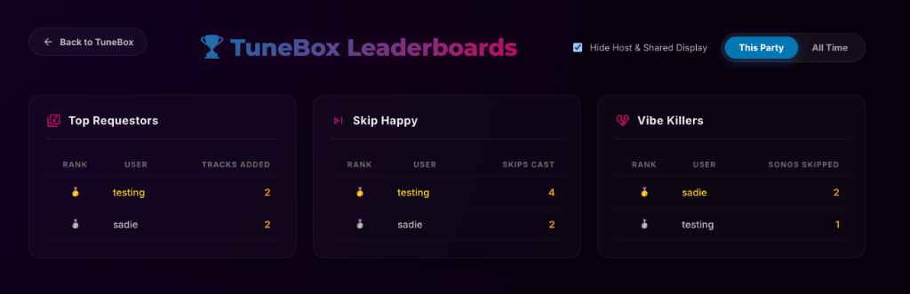

# 🎵 TuneBox

[](LICENSE)

**TuneBox** is a modern, collaborative party jukebox that turns your personal music library into a shared, interactive listening experience. Designed for parties, gatherings, and shared spaces, TuneBox allows guests to queue up songs from any device without an app or account.

---

## ✨ Features

- 🎧 **Plex Music Library Backend**: Streams and indexes music directly from your existing Plex Media Server library or others you have access to
- 🔀 **Cross-Server Unified Queue**: Seamlessly build a single party queue with tracks pulled from multiple different Plex servers at the same time
- 🌐 **Multi-Server Unified Search**: Search across multiple home and shared Plex Media Servers simultaneously with server selection search settings
- 📱 **Guest Access via QR Code**: Guests scan a QR code at your party to browse music and queue tracks instantly—no app installation or accounts required
- ⚡ **Real-Time Queue Synchronization**: Everyone's device stays in sync. Changes to the queue, current track progress, and playback state update instantly across all connected instances
- 🗳️ **Collaborative Skip Voting**: Party guests can vote in real-time to skip songs. When the vote threshold is reached, TuneBox skips to the next track
- 📋 **TuneBox Playlist Pre-Seeding**: Host can import a shuffled sample of tracks from Plex playlists to seed TuneBox. Guest tracks automatically leapfrog ahead of these pre-seeded tracks.
- 📻 **Smart Autoplay Mode**: Keeps music playing when the guest queue runs low by dynamically seeding the queue with related tracks. Guest selections automatically leapfrog ahead and drop fallback tracks.
- 🏆 **TuneBox Party Stats & Leaderboard**: Track party stats (who queued the most, who voted skips, whose tracks got skipped) to see who is contributing to the vibe and who is killing it.
- 🎨 **Responsive, Mobile-First UI**: Clean, intuitive interface for browsing artists, albums, and tracks, adding to the queue, and managing playback
- 🔐 **Setup Wizard**: Simple initial configuration wizard to link your Plex account and choose your preferred audio playback client

---

## 📷 Screenshots

### 🔐 Setup Wizard - Initial Configuration

*Welcome screen to configure your Plex username and TuneBox instance name.*

### 🔑 Setup Wizard - Plex PIN Authorization

*Secure authorization via Plex account PIN link.*

### 🎛️ Setup Wizard - Server & Player Selection

*Select your target Plex Media Server and active playback device.*

### 📱 Artist List & Guest QR Access

*Browse music artists and scan the QR code on the central display screen to join the session instantly.*

### 💿 Artist Albums

*Explore complete artist discographies with high-resolution album artwork.*

### 🎶 Album Track List & Player Queue

*View album track listings, queue songs to TuneBox, and monitor active playback.*

### ⚙️ Host Settings Modal

*Configure server and playback parameters, seed the queue, toggle autoplay, and manage connected devices.*

### 🏆 TuneBox Party Leaderboards & Stats

*View party stats to see who requested the most tracks, who cast the most skip votes, and whose music is getting skipped.*

---

## 🚀 Quickstart

Get TuneBox up and running on your local network using Docker Compose:

### Prerequisites
- [Docker](https://docs.docker.com/get-docker/) & Docker Compose
- A running [Plex Media Server](https://www.plex.tv/) with a Music library

### Installation

1. **Clone the repository:**
   ```bash
   git clone https://github.com/your-repo/TuneBox.git
   cd TuneBox
   ```

2. **Start the containers:**
   ```bash
   docker compose up -d
   ```

3. **Open TuneBox:**
   Navigate to `http://localhost` (or your server's local IP address) in any web browser. You will be greeted by the **Setup Wizard** to link your Plex Media Server and select your active playback player.

---

## 📖 Documentation

For in-depth details on system architecture, custom deployment setups, development guidelines, and API specifications, explore the documentation suite:

- 🏛️ **[System Architecture](docs/architecture.md)**: Deep dive into the tech stack (FastAPI, React, Vite, Redis, Plex API) and component flow diagrams.
- 🛠️ **[Developer Guide](docs/development.md)**: Environment setup, coding standards, local mock library testing, Makefile commands, and step-by-step developer walkthroughs.
- 🌐 **[Deployment & Hosting Guide](docs/deployment.md)**: Production reverse-proxy configuration (Nginx, SSL/HTTPS) and direct LAN deployment instructions.
- 🔌 **[API & WebSocket Reference](docs/api.md)**: Complete specification of REST endpoints and real-time WebSocket protocol events.

---

## 🤖 Attribution & Credits

> **Note**: The architecture, user experience, and design of this project were directed and architected by the project maintainer, with implementation assistance from an AI/LLM coding assistant.

---

## 📄 License

TuneBox is open-source software licensed under the [MIT License](LICENSE).
