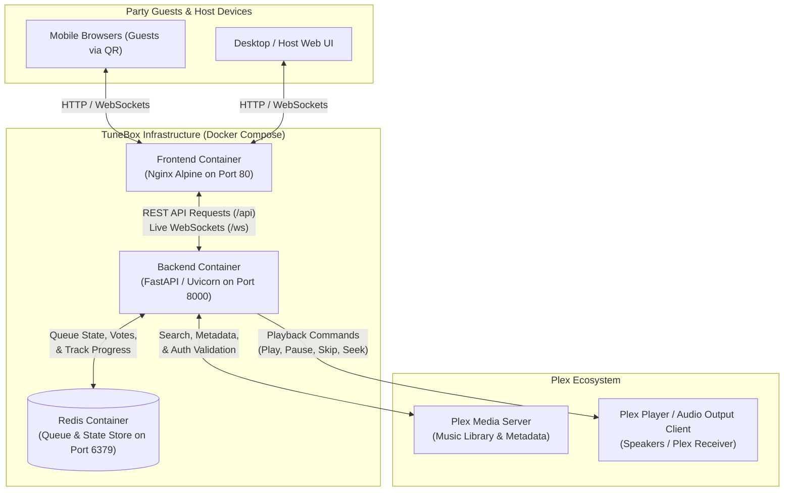
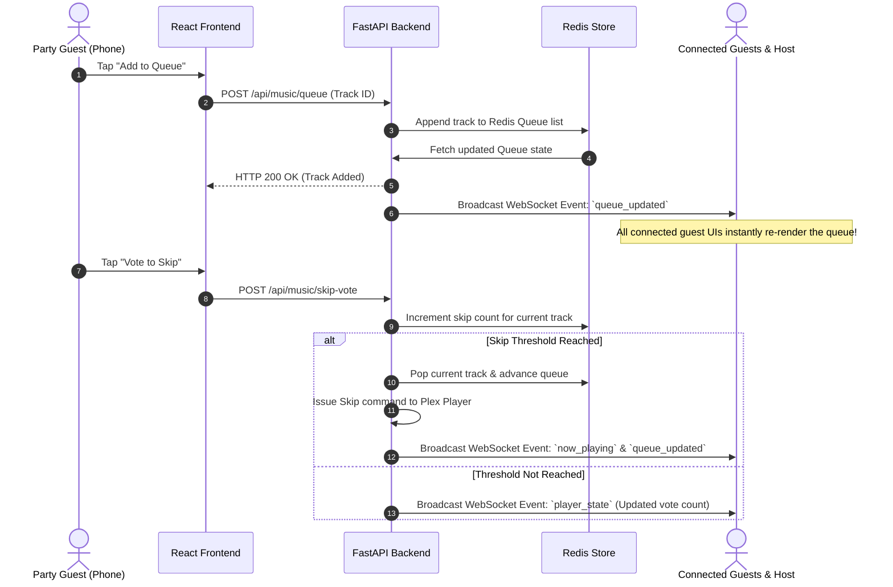

# 🏛️ TuneBox System Architecture

This document provides a detailed technical look at the architecture, component topology, tech stack roles, and real-time data flows powering **TuneBox**.

---

## 🛠️ Tech Stack & Role Breakdown

TuneBox is structured as a decoupled, multi-container architecture orchestrated via Docker Compose.

| Component | Technology | Role & Responsibilities |
| :--- | :--- | :--- |
| **Frontend Framework** | **React & TypeScript** | Renders the single-page application (SPA). Manages UI state, artist/album browsing views, track queue components, and client-side audio player synchronization. |
| **Frontend Production Server** | **Nginx** | In Docker production containers, Node.js compiles the React app into static files (`dist/`), which are served on port `80` by Nginx Alpine. Nginx also proxies `/api` and `/ws` requests to the backend container. |
| **Frontend Local Dev Server** | **Vite** | Used during local development (`npm run dev`) for instant Hot Module Replacement (HMR) and dev proxying. |
| **Backend Server** | **FastAPI** | High-performance asynchronous web server. Handles REST API endpoints (`/api/auth`, `/api/music`), authenticates admin and guest sessions, communicates with the Plex API, processes skip votes, and manages WebSocket connections. |
| **State & Queue Store** | **Redis** | In-memory key-value database serving as the source of truth for the active track queue, current playback timestamp/position, active skip votes, and cached session metadata. |
| **Media Source** | **Plex Media Server API** | External media server hosting the user's music files, album artwork, track metadata, and search indexing via the `plexapi` Python SDK. |
| **Containerization** | **Docker & Docker Compose** | Encapsulates the Frontend, Backend, and Redis services into isolated containers for reproducible deployment. |

---

## 🧩 System Topology Diagram

The diagram below illustrates how external party guests, the host UI, TuneBox backend services, Redis, and the Plex ecosystem interact:

---

## ⚡ Real-Time WebSocket Data Flow

TuneBox relies on WebSockets (`/ws`) to maintain instant real-time synchronization across all guest phones and host displays without polling.

### Sequence: Guest Queues a Song & Votes to Skip

---

## 📦 Service Container Architecture

1. **Frontend Container (`frontend`)**:
   - Multi-stage Docker build: Node.js compiles React app to static files -> Nginx Alpine serves static files on port `80`.
   - Reverse-proxies API traffic internally to `http://backend:8000/api`.

2. **Backend Container (`backend`)**:
   - Runs Uvicorn serving FastAPI on container port `8000`.
   - Implements abstract service handlers: `plex.py` (live Plex server connection) and `mock_data.py` (fallback mock library when `TESTING=true`).

3. **Redis Container (`redis`)**:
   - Runs official `redis:alpine` image on container port `6379`.
   - Utilizes persistent volume mounts to retain queue state across service restarts.
