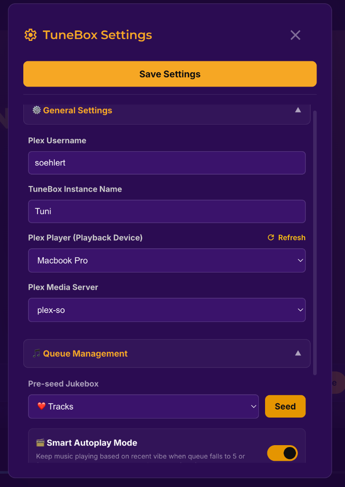

# ⚙️ TuneBox Frontend Settings & Host Controls

This document details the configuration options and host control features in the TuneBox Frontend Settings interface, as well as **Admin Authentication**.

---

## 🔒 Admin Access & Security

TuneBox separates capabilities into host/admin actions and guest actions:
- **Party Guests**: Can browse artists, albums, and tracks, add items to the queue, and cast votes to skip the current track.
- **Host / Admin**: Has access to the **Settings Gear Button** (located on the right side of the **bottom playback controls bar**) and administrative backend actions.

### How Admin Authentication Works
1. **Admin Token**: During the initial Setup Wizard, an `ADMIN_TOKEN` is saved to `.env` and stored in the host browser's `localStorage`.
2. **Header Authorization**: Administrative actions (such as clearing the queue, setting display devices, or changing server settings) automatically include the `x-admin-token` HTTP header:
   ```http
   POST /api/music/clear-queue
   x-admin-token: <your_admin_token>
   ```
3. **Backend Middleware**: The FastAPI backend verifies the `x-admin-token` header against `ADMIN_TOKEN`. Unauthenticated requests to admin endpoints return `HTTP 401 Unauthorized`.
4. **Guest View**: Guests accessing TuneBox do not have the `ADMIN_TOKEN` and will not see the Settings gear button on their bottom bar.

---

## 🎛️ Settings Reference

Clicking the **Settings Gear Button** (⚙) on the right side of the **bottom player bar** opens the Settings Modal:



### 1. Plex Username
- **Description**: Displays and configures the username associated with your Plex account.

### 2. TuneBox Instance Name
- **Description**: Custom display name for this jukebox instance (e.g., *"Living Room Party Box"*).
- **Effect**: Displayed in the bottom player bar and header across connected devices.

### 3. Plex Player (Playback Device)
- **Description**: Dropdown selecting the target Plex playback device:
  - **Selected Player**: Sends queued tracks to play on that specific Plex client or speaker.
  - **`None (Released / Disconnected)`**: Releases TuneBox's hold on the player, leaving the player free for direct manual use.
- **Refresh Button**: Scans your local network and Plex account to discover newly turned-on Plex players without restarting TuneBox.

### 4. Plex Media Server
- **Description**: Dropdown selecting which linked Plex Media Server TuneBox queries for music tracks, albums, artists, and artwork.

### 5. Connected Users Manager
- **Description**: Live list of all guest usernames currently connected to TuneBox.
- **Features**:
  * **Change Username**: Allows the host/admin to rename any user's display name nickname (e.g. rename *"device-82f"* to *"Alex"*).
  * **Make Display**: Designates a user session as a **Shared Display**, showing the Jukebox interface prominently alongside the guest join QR code.
  * **Disconnect User**: Forcefully terminates a guest session.

### 6. TuneBox Party Stats & Leaderboard Link
- **Description**: Direct access link to view the party's full-screen live leaderboard dashboard.
- **Features**: Displays live rankings of Top Requestors, Skip Happy users, and Vibe Killers, switchable between the active session and all-time history.

### 7. Clear Playback Queue
- **Description**: An administrative action button to wipe all upcoming queued tracks.
- **Note**: The queue is an **"Up Next" list** where guests can monitor upcoming songs. Admins use **Clear Queue** to flush the queue when needed.

